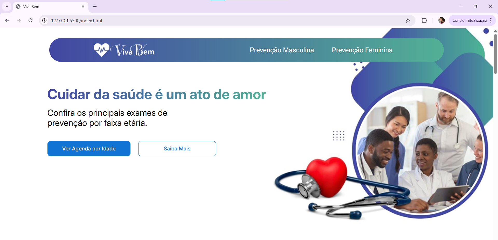

# Projeto Viva Bem 🩺

> Projeto front-end (HTML/SCSS) de um site informativo sobre saúde preventiva, focado em layout responsivo com Flexbox e seguindo um desafio com restrições técnicas.

---

## 🚀 Demo (Online)

Você pode ver o site completo em funcionamento no Vercel:

**[https://fabio-thieres.github.io/projeto-viva-bem/](https://fabio-thieres.github.io/projeto-viva-bem/)**

---

## 📸 Screenshots

| Desktop | Tablet | Celular |
| :---: | :---: | :---: |
|  |  |  |

---

## 📝 Sobre o Projeto

O "Desafio Viva Bem" consistia em construir uma página moderna e informativa sobre a importância dos exames de rotina. O objetivo era criar uma interface limpa, responsiva para 3 tamanhos de tela (desktop, tablet e mobile) e acessível, seguindo um design fornecido no Figma.

---

## 🎯 O Desafio (Restrições)

O requisito técnico mais importante deste projeto era a **proibição** de certas propriedades de CSS para focar no domínio completo do Flexbox.

* ✅ **100% Flexbox:** Todo o alinhamento e estrutura da página foram feitos exclusivamente com `display: flex`.
* ❌ **Sem CSS Grid:** Nenhum `display: grid` foi utilizado.
* ❌ **Sem 'Position':** Nenhuma `position: absolute` ou `relative` foi usada para o layout.
* ❌ **Sem Frameworks:** O projeto foi construído do zero (HTML e SCSS puros) sem Bootstrap, Tailwind, etc.

---

## 🛠️ Tecnologias Utilizadas

* **HTML5:** Estrutura semântica e acessível.
* **SCSS (Sass):** CSS organizado com aninhamento e media queries.
* **Flexbox:** Utilizado para todo o controle de layout e responsividade.

---

## ✨ Principais Recursos

* **Layout Responsivo:** Adaptado para Desktop, Tablet e Celular.
* **Navegação Funcional:** Links âncora no menu que levam às seções corretas.
* **Títulos com Gradiente:** Efeito de texto com `background-clip` para os títulos principais.
* **Código Limpo:** HTML e SCSS bem estruturados e comentados.

---

## 👨‍💻 Autor

Projeto desenvolvido por **Fabio Thieres**.

* 
* 
